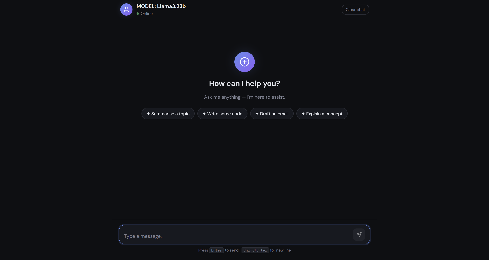
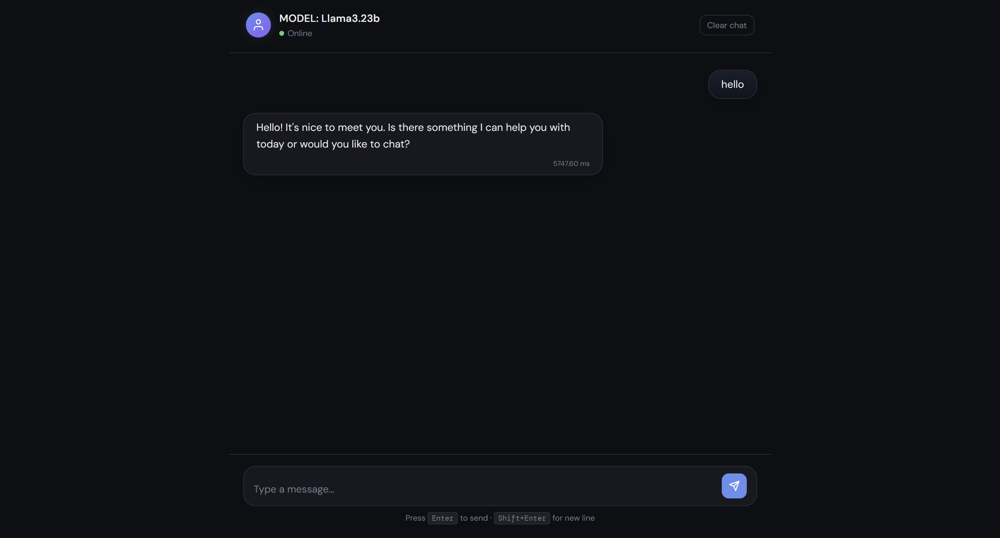
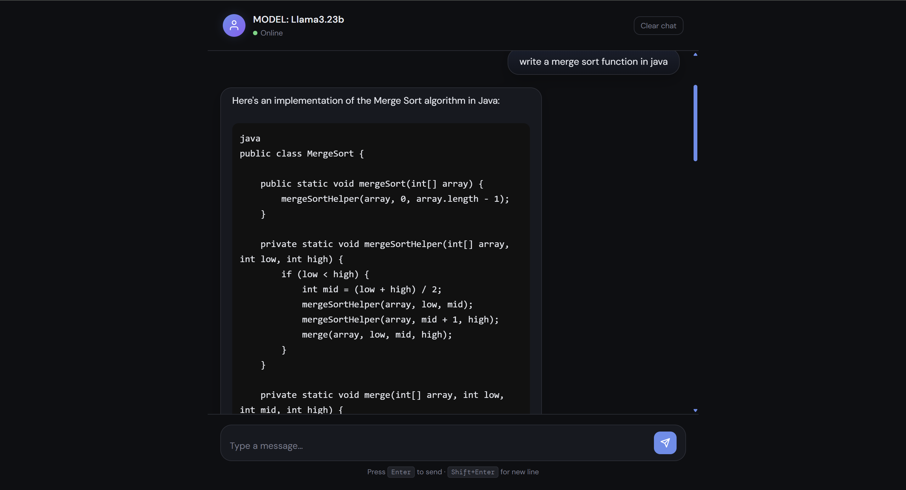

# ChatBot

A simple local chatbot project built with:

- **Frontend:** HTML, CSS, JavaScript
- **Backend:** FastAPI
- **LLM runtime:** Ollama
- **Model:** `llama3.2:3b`

This project provides a clean chat UI in the browser and sends messages to a FastAPI backend, which then gets responses from a locally running Ollama model.

---

## Features

- Simple chat interface
- FastAPI backend API
- Local Ollama integration
- Clear chat support
- Lightweight project structure

---

## Project Structure

```bash
ChatBot/
├── index.html
├── script.ps1
├── script.sh
├── src/
│   ├── script.js
│   └── styles.css
└── server/
    ├── bot.py
    ├── main.py
    └── ollamatest.py

```
## Screen Shots

- UI


- Example 1


- Example 2

